<div align="center">

# 🎮 Flood-It! — Player Retention & Churn Analysis

**An end-to-end analytics project on 5.7 million raw mobile-game events: from a nested GA4 export to a decision memo.**

BigQuery SQL modelling · cohort retention · survival analysis · churn prediction · segmentation · anomaly detection · forecasting


**📄 [Decision memo](reports/decision_memo.md)** · **🧪 [Test harness](tests/)** · **📓 [Notebooks](notebooks/)** · **🗄️ [SQL](sql/)**

</div>

---

## 🔎 TL;DR

> Flood-It! loses **71.4% of new players within a week**, and the median new player churns after
> **1 day**. DAU is flat (−1.3% over 114 days) while the game takes on ~119 new players daily: acquisition
> is buying back the players it loses. The biggest hole is the first level — **66.9% of new players start
> one, and only 42.6% of those finish it**. A day-0 churn model, validated on *later* cohorts, reaches
> **ROC-AUC 0.677 / PR-AUC 0.854** (base rate 0.758) but only **1.17× lift** in the riskiest decile, so the
> recommendation is to fix onboarding for everyone rather than chase individuals with offers.

<div align="center">

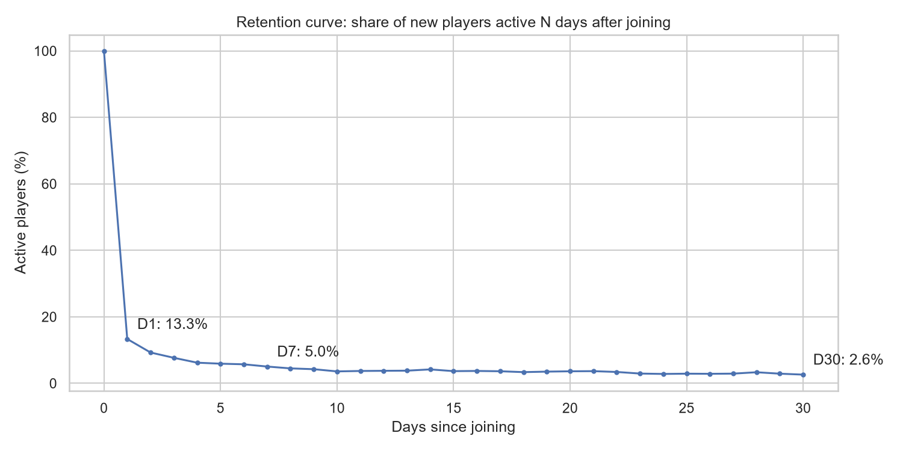

*Share of new players still active N days after joining. 11,066 players, censoring-aware denominators.*

</div>

---

## 📋 Table of contents

| | |
|---|---|
| [1 · The problem](#1--the-problem) | [7 · Verification](#7--verification-how-i-know-the-numbers-are-right) |
| [2 · The data](#2--the-data) | [8 · Reproduce it](#8--reproduce-it) |
| [3 · Architecture](#3--architecture) | [9 · Limitations](#9--limitations) |
| [4 · Key findings](#4--key-findings) | [10 · Repository details](#10--repository-details) |
| [5 · Critical analytical decisions](#5--critical-analytical-decisions) | [11 · Project status](#11--project-status) |
| [6 · Notebooks](#6--notebooks-and-what-each-produces) | [12 · How AI tools were used](#12--how-ai-tools-were-used) |

---

## 1 · The problem

Flood-It! is a real mobile puzzle game. Google publishes 114 days of its raw Google Analytics 4 event
export. Raw event data is what a studio actually has: one row per *thing that happened*, nested fields,
no player table, no session id, no retention column. Everything an analyst reports has to be built first.

This project answers eight questions a game team would actually ask:

| # | Question | Where it is answered |
|---|---|---|
| Q1 | How many players are active, and is that changing? | `sql/10`, [notebook 02](notebooks/02_kpis_retention.ipynb) |
| Q2 | How many new players come back, and when do they stop? | `sql/11`–`13`, notebooks [02](notebooks/02_kpis_retention.ipynb) & [04](notebooks/04_survival.ipynb) |
| Q3 | What do players do on their first day, and how far do they get? | `sql/15`–`16`, notebook 02 |
| Q4 | Which first-day behaviours are associated with returning? | [notebook 03](notebooks/03_player_eda_tests.ipynb) |
| Q5 | Can at-risk players be identified on day 1? | `sql/14`, [notebook 05](notebooks/05_churn_model.ipynb) |
| Q6 | Are there distinct types of player? | [notebook 06](notebooks/06_segmentation.ipynb) |
| Q7 | Did anything unusual happen, and was it real or a tracking bug? | [notebook 07](notebooks/07_anomaly_forecast.ipynb) |
| Q8 | What will engagement look like over the next two weeks? | notebook 07 |

---

## 2 · The data

| Property | Value |
|---|---|
| Source | `firebase-public-project.analytics_153293282` (public BigQuery dataset, GA4 schema) |
| Window | 2018-06-12 → 2018-10-03 (114 days) |
| Events | **5,700,000** across **37 distinct event names** |
| Players | **15,175** device-level ids; **13,588** with at least one `user_engagement` |
| Cohort population | **11,739** new players; **11,066** with a full 7-day follow-up window |
| Top events | `screen_view` 39.4% · `user_engagement` 23.8% · `level_start_quickplay` 9.2% |
| Data quality | 0 events missing a player id · 207 exact duplicate rows (0.004%) · 5,240 placeholder countries (0.09%) · 337,374 placeholder OS values (5.9%) |

Nothing is downloaded: the raw table is queried in place through the free BigQuery sandbox, and the
project creates **views only**, so it consumes no storage quota.

---

## 3 · Architecture

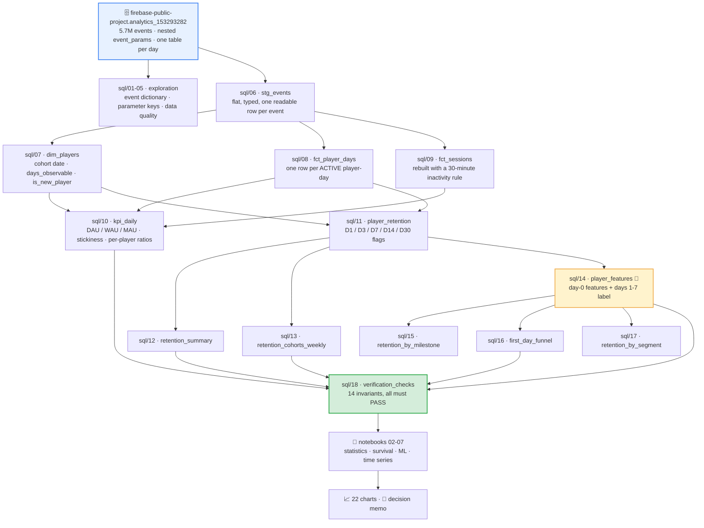

**The modelling table is where a churn project succeeds or fails**, so its time windows are explicit:

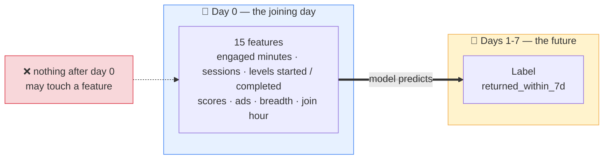

---

## 4 · Key findings

### 4.1 Engagement is flat — the base churns as fast as it grows

| Metric | Value |
|---|---|
| Average DAU | **471.4** |
| Average 28-day MAU (full windows only) | 4,629.4 |
| Stickiness (DAU ÷ MAU) | **10.1%** (range 6.7%–13.8%) |
| Sessions · engaged minutes per active player | 1.55 · 12.2 |
| New players first seen | 13,588 (≈119/day) |
| DAU: first 4 weeks → last 4 weeks | 503.9 → 497.3 (**−1.3%**) |

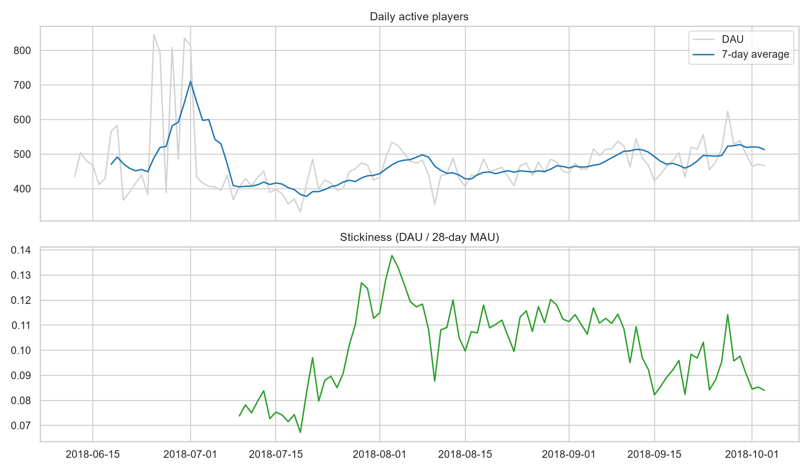

10% stickiness means a typical monthly player opens the game about three days a month. Flat DAU alongside
119 new players a day is the treadmill: the game is buying back the players it loses.

### 4.2 Retention: nearly all the loss happens on day 1

| Day | Eligible | Retained | Retention | 95% CI (Wilson) |
|---|---|---|---|---|
| **D1** | 11,645 | 1,552 | **13.33%** | 12.72 – 13.96 |
| D3 | 11,479 | 880 | 7.67% | 7.19 – 8.17 |
| **D7** | 11,066 | 558 | **5.04%** | 4.65 – 5.47 |
| D14 | 10,360 | 433 | 4.18% | 3.81 – 4.58 |
| **D30** | 8,281 | 216 | **2.61%** | 2.29 – 2.97 |

Survival analysis on the same players: **median time to churn = 1 day**; still-active probability 45.7%
after day 1, 34.0% after day 7, 21.2% after day 30 (90.4% observed churn, 9.6% censored).

| Kaplan-Meier survival | Weekly cohort retention |
|---|---|
| 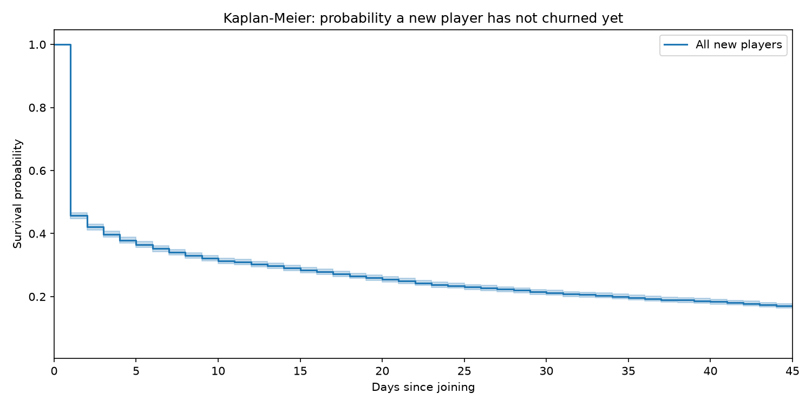 | 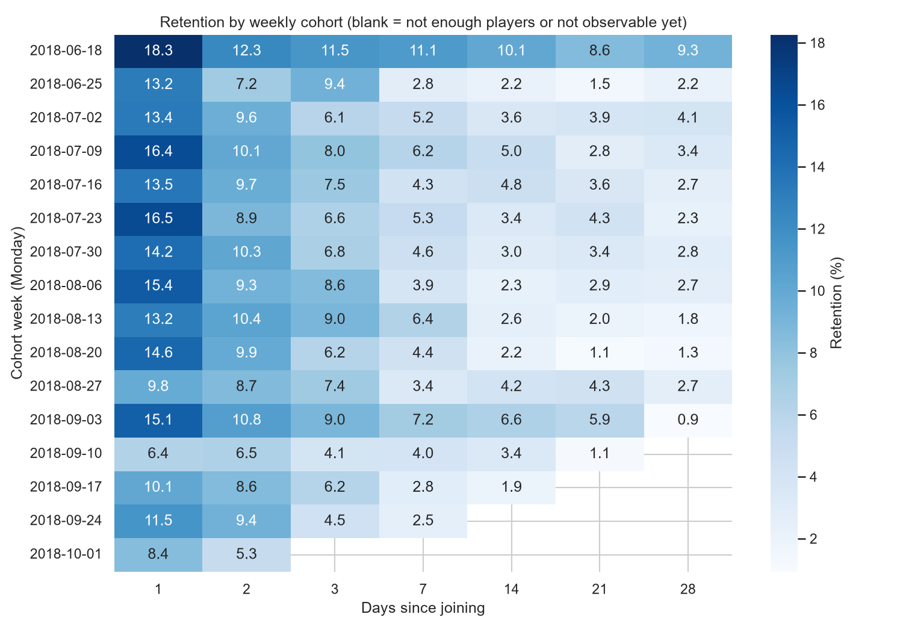 |

D7 retention ranges 2.5%–11.1% across the 16 weekly cohorts with **no monotonic trend** — nothing in this
window looks like a release that moved retention.

### 4.3 The first day decides most of it

| Funnel step (11,066 new players) | Players | % of joiners |
|---|---|---|
| Joined (first `user_engagement`) | 11,066 | 100.0% |
| Started a level on day 0 | 7,398 | 66.9% |
| Completed a level on day 0 | 3,151 | **28.5%** |
| Completed 5+ levels on day 0 | 542 | 4.9% |
| *Outcome:* returned on day 1 | 1,493 | 13.5% |
| *Outcome:* returned within 7 days | 3,170 | 28.6% |

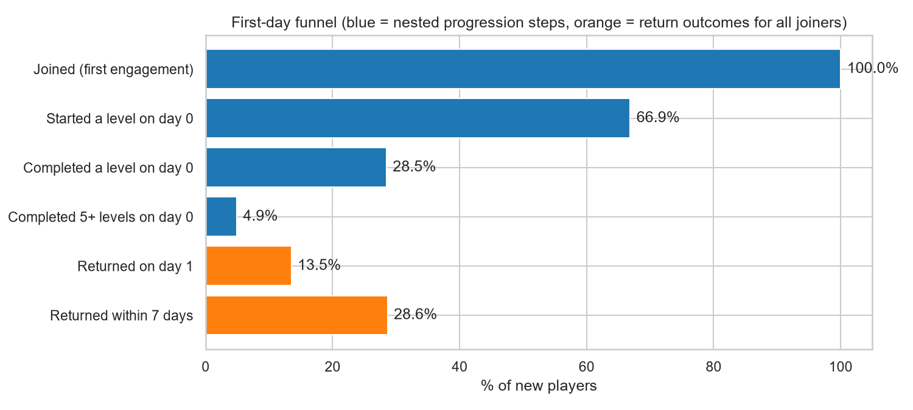

**Biggest single drop: level start → level completion, −38.4 points of all joiners.** 57.4% of players who
start a level never finish one, and the export contains 137,035 `level_fail_quickplay` events across 6,343
players — a difficulty signal, not only an interest signal.

Return rate climbs with first-day progress (χ² = 221.7, df = 3, p = 8.8 × 10⁻⁴⁸) — **descriptive, not
causal**: 23.9% → 26.0% → 35.4% → 48.9% across the four milestone groups (3,664 / 4,247 / 2,613 / 542
players). The top group is defined by measured quickplay completions, not by the `completed_5_levels`
event, which also fires in the game's second level mode.

### 4.4 What predicts coming back: time and depth, not rewards

Mann-Whitney U, rank-biserial effect sizes, Holm-corrected:

| Feature | Median (returned) | Median (churned) | Effect size |
|---|---|---|---|
| Engaged minutes | 4.66 | 2.13 | **0.287** |
| Average session minutes | 5.92 | 3.42 | **0.270** |
| Engagement events | 13 | 8 | 0.259 |
| Scores posted | 1 | 0 | 0.237 |
| Rewarded ads watched | 0 | 0 | **0.006** ← significant, irrelevant |

That last row is the point worth making out loud: with 11,066 players, `p = 0.015` on an effect size of
0.006 means *real but negligible*. Platform is the same story: χ² p = 0.15, Cramér's V = 0.014.

Cox proportional hazards (concordance 0.594) agrees on direction — log engaged minutes HR **0.916**
(0.896–0.937), log levels completed **0.849** (0.817–0.881), day-0 sessions **0.928** (0.897–0.961). The
PH assumption fails for all three, so these are *average* effects over the window — reported, not hidden.

### 4.5 Churn is predictable on day 1 — but only roughly

Trained on cohorts up to 2018-09-04 (8,470 players, 70.0% churn); tested on **later** cohorts (2,596
players, 75.8% churn).

| Model | CV ROC-AUC | Train AUC | Test AUC | Test PR-AUC | Overfit gap |
|---|---|---|---|---|---|
| Baseline (majority) | 0.500 | 0.500 | 0.500 | 0.758 | 0.000 |
| Logistic regression | 0.665 ± 0.011 | 0.670 | 0.671 | 0.849 | −0.001 |
| Random forest | 0.674 ± 0.008 | 0.770 | 0.680 | 0.854 | 0.091 |
| Gradient boosting (untuned) | 0.649 ± 0.010 | **0.905** | 0.646 | 0.832 | **0.259** |
| **Gradient boosting (tuned)** | 0.673 | — | **0.677** | **0.854** | small |

| ROC & precision-recall (later cohorts) | What the model actually relies on |
|---|---|
| 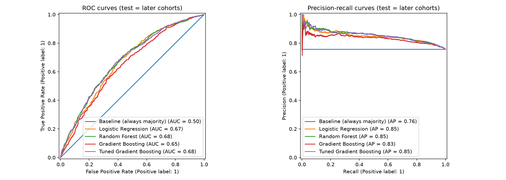 | 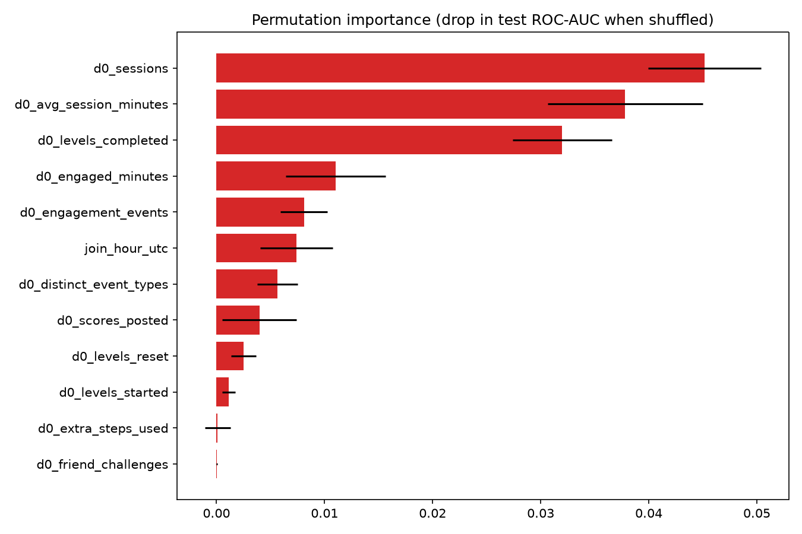 |

- **Riskiest decile:** 88.8% churn vs 75.8% average → **1.17× lift**; the riskiest 30% holds 34.5% of all churners.
- **Calibration:** Brier 0.174 vs 0.187 for the baseline, so the probabilities can carry a decision threshold.
- **Business simulation** (invented economics: 10 units per saved player, 0.5 per offer): targeting the riskiest 10% breaks even at a **5.6% save rate**.
- The untuned booster is the textbook overfit — 0.905 on training players, worst of the four on new cohorts.

### 4.6 Five player types, and one of them is the problem

K-means on day-0 behaviour only (K = 5, silhouette 0.419). Retention was **not** an input, so "this segment
retains better" is a finding rather than a tautology. Stability across five random seeds: **ARI 0.994**.

| Segment | Players | Share | Day-0 minutes (median) | Returned within 7 days |
|---|---|---|---|---|
| **Quick bouncers** | 6,612 | 59.8% | 1.25 | **21.6%** |
| Light samplers | 2,458 | 22.2% | 4.70 | 31.9% |
| Steady players | 692 | 6.3% | 8.78 | 38.0% |
| Keen progressors *(the only ad-watching group)* | 140 | 1.3% | 10.90 | 39.3% |
| **Power players** | 1,164 | 10.5% | 12.77 | **55.2%** |

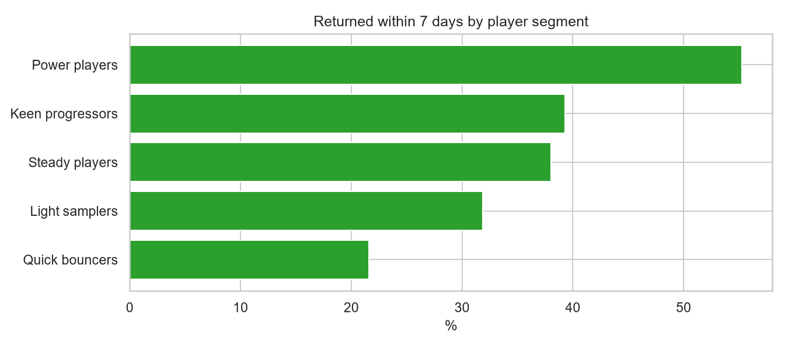

Three in five new players spend about 75 seconds in the game and never start a level
(χ² = 614.7, df = 4, p ≈ 1 × 10⁻¹³¹).

### 4.7 Eight unusual days — and the shape says "tracking", not "players"

| DAU anomalies | Forecast backtest |
|---|---|
| 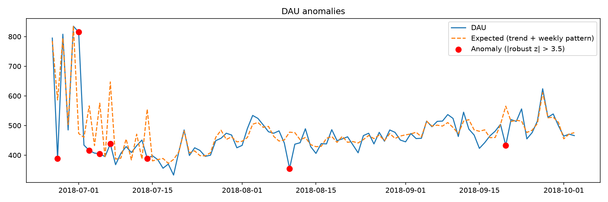 | 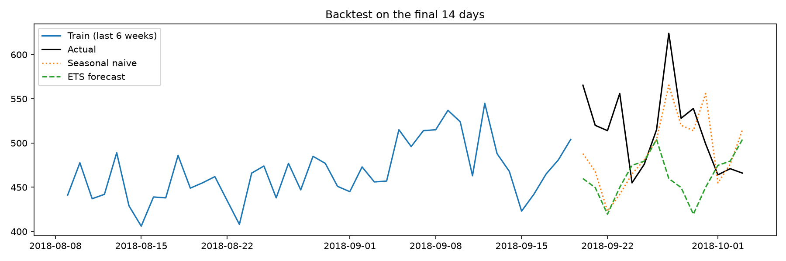 |

STL (7-day season, robust) + a MAD-based robust z-score (|z| > 3.5) flagged **8 of 100 days**:

- **Seven low days** (2018-06-27, 07-03, 07-05, 07-07, 07-14, 08-10, 09-20): DAU falls to 0.66–0.77× of
  expected, while sessions per player stay near 1.0× normal and minutes per player *rise* 1.07–1.50×. The
  players who were recorded behaved normally or more heavily, so the missing mass is light players —
  consistent with **partial event loss**, not an engagement collapse. A question for data engineering, not
  a conclusion.
- **One high day** (2018-07-01): 1.72× expected DAU with per-player ratios at ~1.05× → an acquisition spike.

**Forecast:** the seasonal naive baseline (MAPE **7.70%**, MAE 40.9) beat ETS (MAPE 11.59%, MAE 62.8) on a
14-day backtest, so the honest recommendation is the baseline. Saying that is stronger than shipping a
model that loses to "next Tuesday equals last Tuesday".

### 4.8 Conclusion

The retention problem is **not** a targeting problem — it is an onboarding problem. Churn is so common
(71.4%) and so fast (median 1 day) that flagging individual at-risk players buys little (1.17× lift), while
57.4% of players who try a level never finish one. The recommended next step is a first-levels A/B test
with D1 return as the primary metric, plus level-level instrumentation so "players stall early" can become
"players stall at level N". Full reasoning, recommendations, assumptions and limitations:
**[reports/decision_memo.md](reports/decision_memo.md)**.

---

## 5 · Critical analytical decisions

| Decision | What was done | Why it matters |
|---|---|---|
| **Leakage prevention** | Features come only from the joining day (`WHERE event_date = cohort_date`); the label comes from days 1–7; all preprocessing sits inside a scikit-learn `Pipeline` | Widening the window to "first 48 hours" would leak the day-1 return into the features and produce a brilliant, useless model |
| **Out-of-time validation** | Train on the earlier 75% of cohort dates, test on later cohorts | A random split lets the model learn from players who joined *after* those it is scored on. It also exposed that later cohorts churn more (75.8% vs 70.0%) |
| **Left-censoring** | Players first seen in the export's first 7 days are excluded (`is_new_player`) | They may have installed months earlier; treating them as new would distort every cohort |
| **Right-censoring** | Retention denominators count only players with enough follow-up (`days_observable >= N`); survival analysis treats still-active players as censored | Counting a player who joined 3 days before the export ended as "did not return at D7" understates retention |
| **Active-day definition** | ≥ 1 `user_engagement` event; automatic events (`os_update`, `app_remove`) never make a day active | Otherwise a background OS event inflates DAU |
| **Session rebuild** | `LAG` + 30-minute gap, measured in **seconds** | `TIMESTAMP_DIFF(..., MINUTE)` truncates, so a 30.9-minute gap would silently merge two sessions |
| **Threshold selection** | Chosen by F1 on **out-of-fold training** predictions, then applied once to test | Choosing it on the test set is a hidden form of tuning on test |
| **Effect sizes over p-values** | Rank-biserial, Cramér's V, Wilson intervals, Holm correction throughout | At n = 11,066 almost everything is "significant"; the effect size decides whether it matters |
| **Weighted rates** | Segment rates computed as `SUM(returned)/SUM(players)`, never as an average of percentages | Unweighted averaging moves the iOS return rate from 28.03% to 25.56% |
| **Descriptive ≠ causal** | Milestone and segment comparisons are labelled as associations, on the charts themselves | Motivated players both progress further and return more; only an experiment settles it |
| **Honest baselines** | Dummy classifier, PR-AUC base rate and seasonal naive reported beside every model | "ROC-AUC 0.68" means nothing without them — and here the naive forecast actually wins |

---

## 6 · Notebooks and what each produces

| Notebook | Reads | Produces | Headline output |
|---|---|---|---|
| [01 · extract](notebooks/01_extract_from_bigquery.ipynb) | `sql/*.sql` | 12 views + 12 CSVs | the only notebook that touches BigQuery |
| [02 · KPIs & retention](notebooks/02_kpis_retention.ipynb) | 6 views | 6 charts | D1 13.33%, D7 5.04%, D30 2.61% with Wilson CIs |
| [03 · EDA & tests](notebooks/03_player_eda_tests.ipynb) | `player_features` | 3 charts, `feature_tests.csv` | engaged minutes: effect size 0.287 |
| [04 · survival](notebooks/04_survival.ipynb) | `player_features` | 3 charts | median survival 1 day; Cox HRs + PH check |
| [05 · churn model](notebooks/05_churn_model.ipynb) | `player_features` | 3 charts, 3 CSVs | test ROC-AUC 0.677 / PR-AUC 0.854, lift 1.17× |
| [06 · segmentation](notebooks/06_segmentation.ipynb) | `player_features` | 3 charts, 2 CSVs | K = 5, ARI 0.994 |
| [07 · anomalies & forecast](notebooks/07_anomaly_forecast.ipynb) | `kpi_daily` | 4 charts, 2 CSVs | 8 anomalies; naive beats ETS, 7.70% vs 11.59% |

All seven run top to bottom after a kernel restart, with outputs saved, so every chart and number renders
on GitHub without running anything.

---

## 7 · Verification: how I know the numbers are right

Three independent layers, because a portfolio number that is wrong is worse than no number.

**① `sql/18_verification_checks.sql` — 14 invariants in one query.** One row per player in `dim_players`;
sessions ≥ active player-days; no activity before a player joined; day-0 cohort retention exactly 100%;
retention falls as the day number rises; eligible players fall as the day number rises; funnel step 1
equals the modelling-table size; funnel steps never increase; every modelled player had a full week of
follow-up; no negative features; both churn classes exist; plus two cross-checks that recompute D7 and the
return rate a second way. **Every row must read PASS.**

**② `tests/` — an offline harness, so SQL can be verified without cloud access.**

```bash
python tests/make_simulated_events.py   # seeded event log: planted outage, passive-only days, duplicates
python tests/run_views_duckdb.py        # parses all 19 SQL files, runs views 07-17 on DuckDB, runs sql/18
python tests/run_notebooks.py           # executes notebooks 02-07 in a fresh kernel, counts the 22 charts
```

Latest run: **15/15 harness checks passed**, with `sql/18` returning 14/14 PASS, and DAU, active
player-days, session counts, D1/D3/D7/D14/D30 numerators and denominators and every day-0 feature matching
an **independent pandas re-implementation** exactly. Then **6/6 notebooks executed, 22/22 charts, 8/8
derived CSVs**.

**③ Live-export cross-checks.** Eleven of the fourteen invariants can be re-run directly against the real
exported CSVs (the other three need views that are not exported), plus two consistency checks between the
funnel and the milestone view. All **13/13 pass** on live data, including day-0 cohort retention = 100.0%,
funnel step 1 = 11,066 = modelling-table size, funnel step 4 = the milestone view's top group (542), the
milestone return rate rising monotonically, and D7 (5.04%) being strictly smaller than "returned within 7
days" (28.65%).

| Gate | What it checks | Status |
|---|---|---|
| G-0 | all 19 SQL files parse as GoogleSQL | ✅ |
| G-1 | 14 data-layer invariants | ✅ |
| G-2 | censoring: denominators strictly decrease, D1 > D7 > D30 | ✅ |
| G-3 | cross-tool agreement: SQL vs pandas | ✅ |
| G-4 | leakage: no outcome column in the feature list | ✅ `clean []` |
| G-5 | notebook execution + 22 charts | ✅ |
| G-6 | model sanity: dummy 0.500, test AUC in (0.55, 0.95), PR-AUC > base rate, gap reported | ✅ |
| G-7 | documentation drift: every `d0_*` / outcome column documented | ✅ `none` |

---

## 8 · Reproduce it

**Prerequisites:** Python 3.12 and a Google account. No credit card — the BigQuery sandbox is free.

```bash
# 1 · environment
python -m venv .venv && .venv\Scripts\activate     # Windows; use source .venv/bin/activate elsewhere
pip install -r requirements.txt

# 2 · verify the logic offline first (2 minutes, zero cloud cost)
pip install -r tests/requirements-test.txt
python tests/make_simulated_events.py
python tests/run_views_duckdb.py
python tests/run_notebooks.py

# 3 · point the project at your own Google Cloud project
#     edit notebooks/01_extract_from_bigquery.ipynb, cell 2:  PROJECT_ID = "your-project-id"

# 4 · build everything from the raw dataset
#     run notebook 01            -> creates the dataset, 12 views, exports 12 CSVs
#     run sql/18 in the console  -> 14 rows, all PASS
#     run notebooks 02-07 in order
```

> ⏳ **Sandbox objects expire after 60 days.** If the views are gone, re-run notebook 01 — it rebuilds
> everything in minutes. The SQL files are the artifact, not the views.

---

## 9 · Limitations

- **Obfuscated export.** 5.9% of events carry a placeholder OS, 0.09% a placeholder country, and 207 rows are exact duplicates. Google states the export's internal consistency has limits.
- **Device-level ids only** (`user_pseudo_id`), so one person on two devices counts as two players.
- **No revenue.** Rewarded ads and currency spends are proxies — and both proved irrelevant to retention (effect size 0.006).
- **One game, 114 days, 2018.** Findings do not automatically generalise.
- **Seven days are probable event loss**, so every DAU-derived metric on those dates is understated; they were replaced with expected values before forecasting.
- **The game has two parallel level modes.** All level metrics here cover quickplay only. The `completed_5_levels` event spans both modes, so it is excluded from the funnel and milestone definitions, which use measured quickplay completions (`d0_levels_completed >= 5`) instead.
- **Proportional hazards fails** for all three behavioural covariates, so the Cox hazard ratios are average effects over the window.
- **Cross-validation folds are not byte-stable across runs.** BigQuery returns view rows unordered, so a
  re-export reshuffles `player_features.csv` and the stratified folds land differently. Test-set metrics
  move by about ±0.002 AUC and cross-validated means by about ±0.005; the ranking of the four models,
  the overfitting gaps and every conclusion are unaffected. Adding `ORDER BY` to the export query would
  pin it exactly.
- **Everything outside an experiment is associational.** No causal claim is made anywhere in this repository.

---

## 10 · Repository details

```
flood-it-retention/
├── sql/                 19 files · exploration → staging → dimensions/facts → metrics → modelling table → 14 invariants
├── notebooks/            7 files · 01 extraction (BigQuery) + 02-07 analysis (CSV only, no cloud cost)
├── tests/                4 files · simulated-data generator + DuckDB view harness + notebook runner
├── reports/
│   ├── figures/         22 PNG charts produced by notebooks 02-07
│   └── decision_memo.md  the deliverable: findings, recommendations, assumptions, limitations
├── data/processed/       CSV exports (git-ignored; rebuilt from BigQuery in minutes)
├── requirements.txt      the analysis stack
└── .gitignore            blocks credentials, exports, virtual environments and harness artifacts
```

| | |
|---|---|
| **Stack** | BigQuery (GoogleSQL) · Python 3.12 · pandas · NumPy · SciPy · statsmodels · scikit-learn · lifelines · matplotlib · seaborn · DuckDB + sqlglot (tests) |
| **Author** | Aishwary Srivastava |
| **Suggested GitHub topics** | `bigquery` · `game-analytics` · `retention-analysis` · `churn-prediction` · `survival-analysis` · `cohort-analysis` · `sql` · `python` · `data-science` |
| **Credentials** | None are stored anywhere. Authentication uses `pydata_google_auth` browser sign-in, and `.gitignore` blocks `*.json` as a safety net |

---

## 11 · Project status

| Component | Status |
|---|---|
| SQL data layer (19 files, 12 views) | ✅ built and verified |
| 14 data-layer invariants | ✅ passing |
| Notebooks 01–07 | ✅ executed end to end, outputs saved |
| 22 charts | ✅ generated from the live dataset |
| Offline test harness | ✅ 15/15 checks |
| Decision memo | ✅ written from the real results |

---

## 12 · How AI tools were used

I used Claude (Claude Code) to explain nested BigQuery syntax, review wording, debug environment and
authentication problems, and to build the offline test harness in `tests/`. Every analytical decision,
every definition and the memo's conclusions are mine. No number in this repository is quoted from a model:
each is produced by a notebook cell whose output is committed, and the key ones are verified twice — SQL
against an independent pandas re-implementation, plus structural invariants such as day-0 cohort retention
being exactly 100% and the dummy classifier scoring exactly 0.500.
